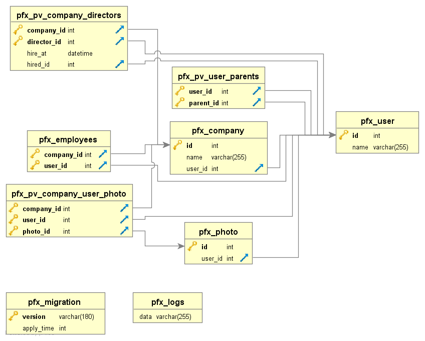

Трейт для помощи в создании базы  

|Метод|Описание
|------|---------
|self::foreignKey($table)|установка Foreign Key на поле  
|self::pivot($table)|создание сводной таблицы из 2х primary key
|dropIndexByColumn('{{%user}}', 'name')|Удаление индекса по столбцу
|dropForeignKeyByColumn('{{%photo}}', 'user_id')|Удаление FK по столбцу
|createIndex(null, '{{%user}}', 'name')|Создание индекса с автоматическим именем


```php
<?php

class m170812_175803_test extends \yii\db\Migration
{
    use \carono\yii2migrate\traits\MigrationTrait;

    public function newColumns()
    {
        return [
            '{{%company}}' => [
                // Создаём FK на user, с правилом SET NULL при удалении
                'user_id' => self::foreignKey('{{%user}}')->notNull()->onDeleteNull(),
                // Создаём сводную таблицу employees
                'users' => self::pivot('{{%user}}')->tableName('{{%employees}}')
            ]
        ];
    }

    public function newTables()
    {
        return [
            '{{%user}}' => [
                'id' => self::primaryKey(),
                'name' => self::string()
            ],
            '{{%photo}}' => [
                'id' => self::primaryKey(),
                'user_id' => self::integer()
            ],
            '{{%company}}' => [
                'id' => self::primaryKey(),
                'name' => self::string(),
                'directors' => self::pivot('{{%user}}', 'director_id')->columns(
                    [
                        'hire_at' => self::dateTime(),
                        'hired_id' => self::foreignKey('{{%user}}')
                    ]
                )  // Создаём сводную таблицу pv_company_directors
            ]
        ];
    }

    public function newIndex()
    {
        return [
            ['{{%company}}', 'name']
        ];
    }

    public function safeUp()
    {
        $this->upNewTables();
        $this->upNewColumns();
        $this->alterColumn('{{%photo}}', 'user_id', self::foreignKey('{{%user}}'));
        $this->upNewIndex();
        $this->createIndex(null, '{{%user}}', 'name');
    }

    public function safeDown()
    {
        $this->dropIndexByColumn('{{%user}}', 'name');
        $this->downNewIndex();
        $this->dropForeignKeyByColumn('{{%photo}}', 'user_id');
        $this->downNewColumns();
        $this->downNewTables();
    }
}
```

